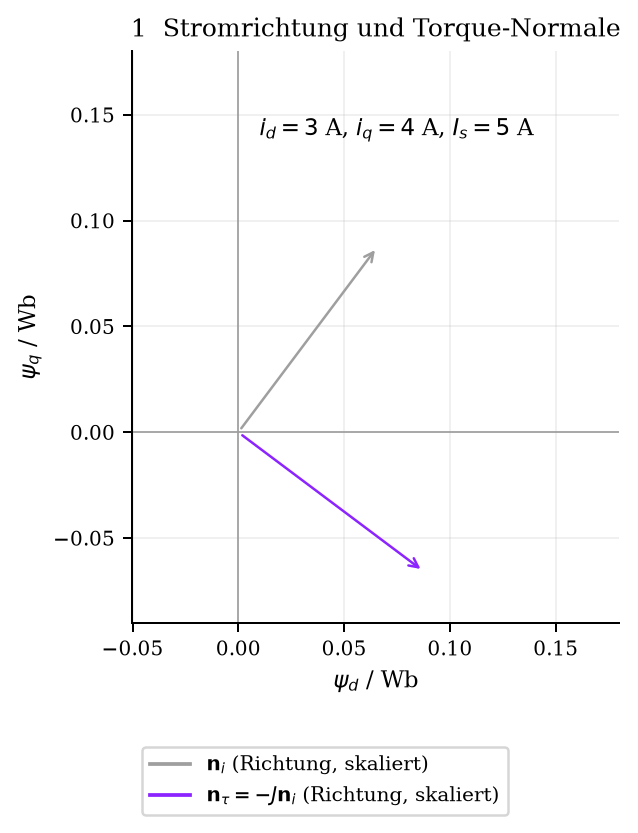
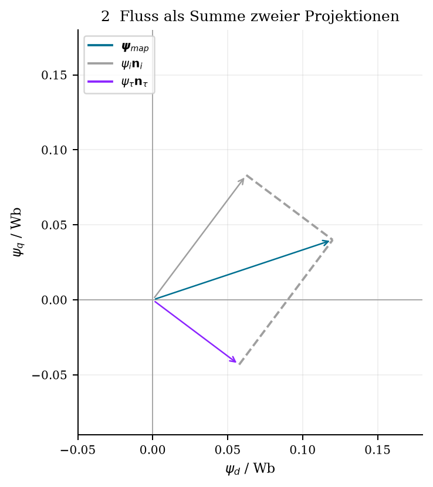
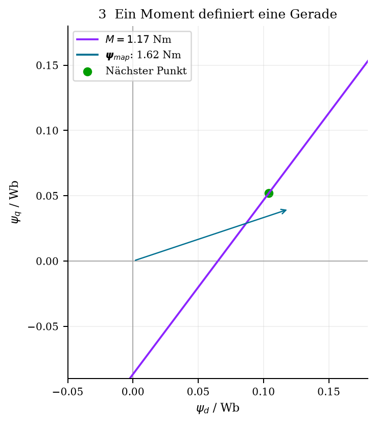
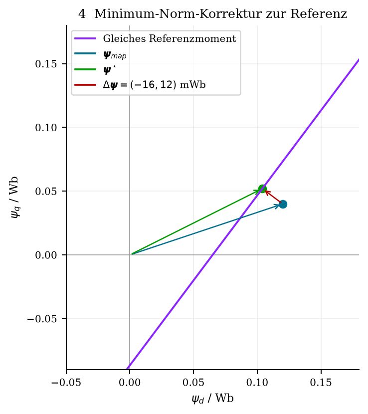
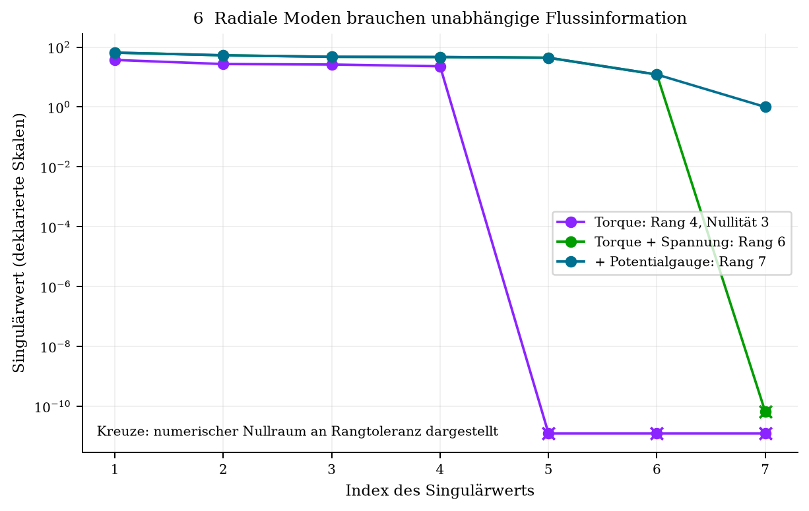
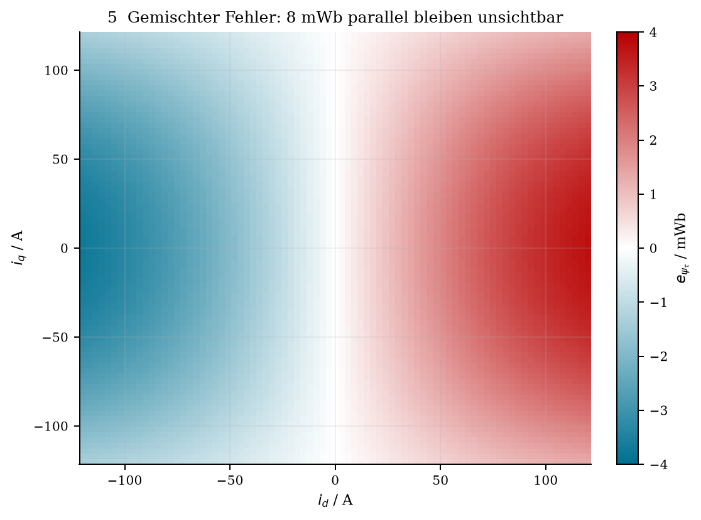

# Torque consistency zur Bewertung und Korrektur von Flusskennfeldern

**Status: Forschungskonzept mit synthetischer Validierung; keine experimentell
freigegebene Kennfeldkorrektur. Stand: 7. Oktober 2026.**

Drehmoment beobachtet bei bekanntem, von null verschiedenem Statorstrom genau
eine Projektion des dq-Flussvektors. Die vorgeschlagene Umrechnung eines
Drehmomentresiduums in Weber und die lokale Minimum-Norm-Korrektur sind
mathematisch richtig unter den unten festgelegten Konventionen. Sie liefern
keine eindeutige Rekonstruktion beider Flusskomponenten und identifizieren
keine Fehlerursache. Der nächste praktische Einsatz ist eine Diagnose mit
unabhängig qualifizierter Momentreferenz. Eine globale Korrektur benötigt
zusätzliche elektrische Information, Unsicherheiten und eine geprüfte Modellklasse.

Eine wesentliche Ergänzung zur Ausgangsnotiz ist der **globale radiale
Nullraum**: Selbst ein glattes, reziprokes und symmetrisches Kennfeld kann
beliebige drehmomentunsichtbare radiale Flussanteile enthalten. Regelmäßigkeit
oder eine eindeutige regularisierte Lösung ersetzen keine Beobachtbarkeit.

## Einordnung in den vorhandenen Bestand

Der geprüfte Git-Stand ist `23ab6ef`; bestehende lokale Änderungen bleiben
erhalten. Die Research-Seite ergänzt die beiden Flussarbeiten, ohne ihre
experimentellen Schlussfolgerungen zu ändern.

| Vorhandener Baustein | Quelle im Repository | Anschluss der Torque-Idee |
|---|---|---|
| Stationäre Rekonstruktion und Drehsinn | [Spannungsmodell](../papers/flux_map_error_diagnostics/sections/02_steady_state_flux_reconstruction.tex) | Dasselbe $J$, dieselbe elektrische Drehzahl und dieselben dq-Flüsse |
| Symmetrie und Widerstandsäquivalent | [flux_correction.py](../papers/flux_map_error_diagnostics/python/flux_correction.py), [Widerstandsdiagnose](../papers/flux_map_error_diagnostics/sections/05_reconstruction_error_sensitivity.tex) | Torque-Residual ist ein weiterer Beobachtungskanal; kein neuer Widerstandsbeweis |
| Messdaten und Plotexport | [Diagnose-README](../papers/flux_map_error_diagnostics/README.md), `python/analyze_*_dataset.py`, `python/export_experiments.py` | Bestehende Rohdaten-, Paarungs- und Exportlogik bleibt erhalten |
| Koenergie und Reziprozität | [Potentialherleitung](../papers/physics_constrained_flux_maps/sections/03_magnetic_coenergy.tex), [Audit](../papers/physics_constrained_flux_maps/docs/coenergy_analysis_audit.md) | Eine Potentialbasis koppelt Flüsse, lässt aber radiale Moden unbeobachtet |
| Terminalstrom versus Magnetisierungsstrom | [Diskussion](../papers/physics_constrained_flux_maps/sections/09_discussion.tex) | Vor Torque-Fusion muss dieselbe physikalische Strom-/Flussdefinition gelten |
| PSM und EESM | [PSM-Modell](../papers/psm_voltage_geometry/sections/02_machine_model.tex), [EESM-Modell](../papers/temp_eesm_Mopt/sections/02_model_and_quadrics.tex) | $k_{\mathrm T}=3p/2$, EESM-Erregerstrom heißt kanonisch $i_{\mathrm e}$ |
| Synthetische Magnetik und Darstellung | [magnetic_model.py](../papers/flux_map_error_diagnostics/numerics/magnetic_model.py), [publication_plotting.py](../shared/python/publication_plotting.py) | Bestehende dimensionslose Magnetik mit deklarierten Basisgrößen; gemeinsame Palette |

`sandbox/flux_correction.py` und die gleichnamigen paper-eigenen Dateien sind
bereits vorhanden; diese Untersuchung führt keine weitere produktive
Korrekturbibliothek ein. [WRITING_GUIDE.md](../WRITING_GUIDE.md) und der
[didaktische Vertrag](didactic_contract.md) bestimmen die Reihenfolge:
Geometrie, dann Algebra, dann physikalische und numerische Grenzen.

## Konventionen und Referenzmoment

Im zweidimensionalen **Statorraum** gelten

\[
\mathbf i_s=(i_d,i_q)^\top,\quad
\boldsymbol\psi=(\psi_d,\psi_q)^\top,\quad
J=\begin{bmatrix}0&-1\\1&0\end{bmatrix},\quad
\omega_e=p\omega_m=2\pi p n/60.
\]

Die kanonische allgemeine Größe `sym:i` kann in EESM-Arbeiten auch drei
Koordinaten enthalten. Deshalb heißt der zweidimensionale Vektor hier
ausdrücklich $\mathbf i_s$; sein Betrag $I_s$ enthält keinen Erregerstrom.
Die vorhandenen Schlüssel `sym:istator`, `sym:fluxvec`, `sym:jrot`, `sym:p`,
`sym:kt`, `sym:er`, `sym:coenergy` werden weiterverwendet. Die neuen
Projektionsgrößen werden zentral in `shared/glossary/symbols.tex` registriert.

Amplitude-invariante, gleich skalierte Strom- und Flusskoordinaten mit
d-Achse am positiven Erregerfluss geben

\[
M=k_{\mathrm T}(i_q\psi_d-i_d\psi_q),\qquad k_{\mathrm T}=\tfrac32p.
\]

Bei positivem PM-Fluss und (i_d=0,i_q>0) ist $M>0$.
Die [MathWorks-Dokumentation zum FEM-PMSM](https://www.mathworks.com/help/simscape-electrical/ref/femparameterizedpmsm.html)
zeigt dieselbe Gleichung für die sinusförmige dq-Modellklasse.
Sie ist kein allgemeines Momentanmodell für sämtliche Raumharmonischen.

Die [Park-Dokumentation](https://www.mathworks.com/help/simscape-electrical/ref/parktransform.html)
unterscheidet die Faktoren $2/3$ und $\sqrt{2/3}$. Daraus folgt durch
Nachskalierung: Bei orthonormalen, leistungsinvarianten dq-Größen sind beide
Vektoren gegenüber amplitude-invarianten Größen um $s=\sqrt{3/2}$
vergrößert, also ist der Vorfaktor $p$. Allgemein gilt bei positiven
Skalierungsfaktoren $s_i,s_\psi$:

\[
k_{\mathrm T}^{\rm neu}=\frac{3p}{2s_i s_\psi}.
\]

RMS-Konventionen, Achsentausch oder ein entgegengesetzter q-Drehsinn müssen
gesondert transformiert werden. Wb bezeichnet **Flussverkettung**, nicht
ungeprüft den magnetischen Fluss einer einzelnen Windung. $k_{\mathrm T}$
ist hier dimensionslos; A Wb = J = N m. Die Normierung verändert die
Zahlenwerte der als Wb dargestellten Projektionen.

Für die linearen Spezialmodelle ist

\[
\begin{array}{ll}
\text{PSM:}& \psi_d=\psi_{\rm pm}+L_di_d,\quad \psi_q=L_qi_q,\\
\text{EESM:}& \psi_d=L_di_d+L_{\mathrm e}i_{\mathrm e},\quad \psi_q=L_qi_q.
\end{array}
\]

Die EESM ergibt genau das vorhandene Modell

\[
M=k_{\mathrm T}i_q\bigl[L_{\mathrm e}i_{\mathrm e}+(L_d-L_q)i_d\bigr].
\]

Sättigung und Kreuzsättigung ändern die Flussfunktionen, nicht die lokale
lineare Projektion bei festem Strom im zugrunde gelegten dq-Modell.
Die Erregerflussverkettung ist durch die statorische Momentgleichung nicht
unmittelbar messbar. In einer vollständigen EESM-Koenergie mit **physischem**
DC-Erregerstrom ist bei der vorhandenen $3/2$-Normierung

\[
dW'=\psi_d\,di_d+\psi_q\,di_q+\tfrac23\psi_{\mathrm f}\,di_{\mathrm e}.
\]

Eine dreidimensionale Gradientenbasis darf den Faktor $2/3$ am Rotorport
nicht übergehen. Die statorische Reziprozität gilt bei festem $i_{\mathrm e}$
in geeigneten magnetischen Speicherkoordinaten.

Das Eingangsdatum ist $M_{\rm em,ref}$, eine qualifizierte Referenz zum selben
Modellmoment. Für eine ausdrücklich so definierte mechanische Bilanz gilt

\[
J_m\dot\omega_m=M_{\rm em,ref}-M_{\rm shaft}-M_{\rm loss},\qquad
M_{\rm em,ref}=M_{\rm shaft}+M_{\rm loss}+J_m\dot\omega_m.
\]

$J_m$ ist die relevante mechanische Trägheit, nicht der Rotationsgenerator
$J$. $M_{\rm loss}$ ist ein **vorzeichenbehaftetes** Verlustmoment der
gewählten Systemgrenze. Bei negativer Drehzahl wird nicht unverändert ein
positiver Verlustbetrag addiert. Sensorlage, Lastträgheit, Beschleunigung,
Zeitbezug und die Zuordnung elektromagnetischer Verluste sind Teil der Bilanz.
Insbesondere muss geklärt werden, ob das dq-Modell ein über Terminalstrom
berechnetes Konversionsmoment oder das mechanisch verfügbare Magnetisierungsmoment
beschreibt; ein pauschales mechanisches Reibmodell löst diesen Unterschied nicht.

## Geometrie der beobachteten Projektion

Für $I_s=\|\mathbf i_s\|>0$ ist

\[
\mathbf n_i=\frac{\mathbf i_s}{I_s},\qquad
\mathbf a=-J\mathbf i_s=(i_q,-i_d)^\top,\qquad
\mathbf n_\tau=\frac{\mathbf a}{I_s}.
\]

$J$ dreht gegen den Uhrzeigersinn; die Torque-Normale ist folglich die
**im Uhrzeigersinn** gedrehte Stromrichtung. Die lokale orthonormale Basis
$(\mathbf n_i,\mathbf n_\tau)$ hat Determinante $-1$; sie ist keine
zusätzliche rechtsorientierte Park-Transformation.

Die Pfeile bilden Richtungen im Flussraum ab. Der Strompfeil wird als
normierte Richtung dargestellt: A und Wb werden nicht auf derselben metrischen
Achse addiert. In dieser Basis zerfällt der Fluss in

\[
\boldsymbol\psi=\psi_i\mathbf n_i+\psi_\tau\mathbf n_\tau,\quad
\psi_i=\mathbf n_i^\top\boldsymbol\psi,\quad
\psi_\tau=\frac{i_q\psi_d-i_d\psi_q}{I_s}.
\]

Damit ist $M=k_{\mathrm T}I_s\psi_\tau$. Die Projektion ist eine
stromabhängige lineare Funktion des Flussvektors, kein neuer physikalischer
Magnetfluss und nicht dessen Betrag. Sie ist auch nicht gleich der schon
verwendeten active-flux-Größe $s_\psi$: Für die lineare EESM gilt

\[
s_\psi=(L_d-L_q)i_d+L_{\mathrm e}i_{\mathrm e},\qquad
\psi_\tau=(i_q/I_s)s_\psi.
\]

Das Vorzeichen und der Faktor (i_q/I_s) gehören zur Projektion.

## Residuum und lokale Beobachtbarkeit

Die vorgeschlagene Definition passt zur Konvention Modell minus Referenz:

\[
e_M=M_{\rm map}-M_{\rm em,ref},\qquad
\psi_{\tau,\rm map}=\mathbf n_\tau^\top\boldsymbol\psi_{\rm map},\qquad
\psi_{\tau,\rm meas}=\frac{M_{\rm em,ref}}{k_{\mathrm T}I_s},
\]

\[
\boxed{e_{\psi_\tau}=\psi_{\tau,\rm map}-\psi_{\tau,\rm meas}
=\frac{e_M}{k_{\mathrm T}I_s}.}
\]

Ein positiver Wert bedeutet zu viel vorhergesagte **vorzeichenbehaftete**
Torque-Projektion. Das Residuum kann auch aus Strom-, Sensor-, Verlust- oder
Modellfehlern stammen. Der Name torque-equivalent flux residual beschreibt
diese diagnostische Rolle, ohne die Ursache festzulegen.

Bei festem Strom hat $[i_q,-i_d]$ Rang eins und Nullraum

\[
\ker\mathbf a^\top=\operatorname{span}\{\mathbf i_s\}.
\]

Bei $I_s=0$ sinkt der Rang auf null: Jede Flussrichtung ist unsichtbar.
Für $I_s>0$ bilden alle Flüsse mit Referenzmoment die Gerade

\[
\{\boldsymbol\psi:\ \mathbf a^\top\boldsymbol\psi=M_{\rm em,ref}/k_{\mathrm T}\}.
\]

In der kleinen Rechnung $p=3,\mathbf i_s=(3,4)\,\mathrm A$ ist
$\mathbf n_\tau=(0.8,-0.6)^\top$. Mit
$\boldsymbol\psi_{\rm map}=(0.12,0.04)\,\mathrm{Wb}$ ergibt sich
$M_{\rm map}=1.62\,\mathrm{Nm}$. Bei $M_{\rm em,ref}=1.17\,\mathrm{Nm}$
ist $e_{\psi_\tau}=0.020\,\mathrm{Wb}$. Die Differenz von 0.45 Nm
beobachtet genau diese 20 mWb, nicht die ganze Flussabweichung.

## Minimum-Norm-Korrektur und Gewichtung

Die Lösungsgerade liefert keine bevorzugte Position. Die Annahme der
kleinsten Änderung wählt ihre orthogonale Projektion vom vorhandenen Fluss:

\[
\min_{\Delta\boldsymbol\psi}\tfrac12\|\Delta\boldsymbol\psi\|^2,
\quad \mathbf a^\top\Delta\boldsymbol\psi=b,
\quad b=-e_M/k_{\mathrm T}.
\]

Mit $\mathcal L=\tfrac12\Delta\boldsymbol\psi^\top\Delta\boldsymbol\psi
+\lambda(\mathbf a^\top\Delta\boldsymbol\psi-b)$ gibt Stationarität
$\Delta\boldsymbol\psi=-\lambda\mathbf a$ und
$\lambda=-b/I_s^2$. Somit

\[
\boxed{\Delta\boldsymbol\psi^\star
=-\frac{e_M}{k_{\mathrm T}I_s^2}(i_q,-i_d)^\top
=-e_{\psi_\tau}\mathbf n_\tau.}
\]

Als zweite Herleitung liefert die Pseudoinverse der Zeile
$\mathbf a^\top$ unmittelbar $\mathbf a b/(\mathbf a^\top\mathbf a)$.
Die parallele Projektion bleibt gleich. Im Beispiel ist die Änderung
$(-0.016,0.012)\,\mathrm{Wb}$, der neue Fluss
$(0.104,0.052)\,\mathrm{Wb}$ und das neue Moment 1.17 Nm.

Für $W\succ0$ ersetzt die Kostenellipse den Kreis:

\[
\min\tfrac12\Delta\boldsymbol\psi^\top W\Delta\boldsymbol\psi,
\qquad
\boxed{\Delta\boldsymbol\psi^\star
=W^{-1}\mathbf a\frac{b}{\mathbf a^\top W^{-1}\mathbf a}.}
\]

$W=C_\psi^{-1}$ entspricht einer angenommenen positiv definiten
Flusskovarianz; eine sicherere Komponente wird stärker bestraft.
Die gewichtete Lösung kann einen stromparallelen Anteil haben. **Nur die
ungewichtete Lösung garantiert unverändertes $\psi_i$.** Eine singuläre
Kovarianz benötigt eine ausdrücklich formulierte eingeschränkte Schätzung.
Bei unsicherem Moment ist die harte Nebenbedingung gewöhnlich ungeeignet.
Für den lokalen Gaußfall liefert eine weiche Aktualisierung stattdessen

\[
\Delta\boldsymbol\psi
=C_\psi\mathbf h\frac{M_{\rm em,ref}-M_{\rm map}}
{\sigma_M^2+\mathbf h^\top C_\psi\mathbf h},\qquad
\mathbf h=k_{\mathrm T}\mathbf a.
\]

Diese Gleichung ist eine statistische Modellwahl, keine Identifikation der
wahren Flussänderung. Eine punktweise Korrektur kann Reziprozität, Glätte und
Induktivitätsqualität verletzen; sie dient hier ausschließlich als Erklärung.

## Verbindung zur elektrischen Konsistenz

Das vorhandene stationäre Modell ist
$\mathbf u=R_s\mathbf i_s+\omega_eJ\boldsymbol\psi$.
Mit $\varepsilon_R=\hat R_s-R_s$, korrekter Spannung, Drehzahl und Strom
gilt für den rekonstruierten Fluss

\[
\boldsymbol\psi^{\rm rec}-\boldsymbol\psi
=\frac{\varepsilon_R}{\omega_e}J\mathbf i_s
=-\frac{\varepsilon_R I_s}{\omega_e}\mathbf n_\tau.
\]

Die Vorzeichen folgen direkt aus den bestehenden Komponentenformeln:
$\Delta\psi_d=-\varepsilon_R i_q/\omega_e$,
$\Delta\psi_q=\varepsilon_R i_d/\omega_e$. Daher

\[
\boxed{e_{\psi_\tau}=-\varepsilon_R I_s/\omega_e,\quad
e_M=-k_{\mathrm T}\varepsilon_R I_s^2/\omega_e.}
\]

Unter genau dieser Ein-Ursachen-Hypothese kann

\[
\Delta R_{\rm eq,torque}:=-\frac{\omega_e e_M}{k_{\mathrm T}I_s^2}
\]

mit den vorhandenen Symmetrie-/Pfadäquivalenten verglichen werden. Es ist ein
**bedingtes Äquivalent**, kein identifizierter Wicklungswiderstand.
Eine skalierte Spannungskomponente parallel zum Strom kann denselben Effekt
erzeugen. Ein echter unabhängiger Momentkanal hilft beim Prüfen, hebt diese
Ursachenkonfundierung aber nicht von sich aus auf.

Bei bekanntem $R_s$ hat der lokale elektrische Operator
$H_U=\omega_eJ$ Rang zwei für $\omega_e\ne0$. Dann ist Fluss bereits
elektrisch beobachtbar; Torque ergänzt Redundanz und einen unabhängigen
Konsistenztest. Bei unbekanntem $R_s$ sind zwei Spannungen für drei
Unbekannte nicht ausreichend. Die gemeinsame Sensitivität ist

\[
H_{U,M}=
\begin{bmatrix}
0&-\omega_e&i_d\\
\omega_e&0&i_q\\
k_{\mathrm T}i_q&-k_{\mathrm T}i_d&0
\end{bmatrix},\qquad
\det H_{U,M}=-k_{\mathrm T}\omega_e I_s^2.
\]

Bei $I_s>0,\omega_e\ne0$ ist sie algebraisch invertierbar, wenn das
Moment wirklich den gleichen Konversionszusammenhang beobachtet. Über die
Leistungsbilanz folgt äquivalent

\[
\mathbf u^\top\mathbf i_s=R_s I_s^2+\omega_e M/k_{\mathrm T},\qquad
R_s=\frac{\mathbf u^\top\mathbf i_s-\omega_e M_{\rm em,ref}/k_{\mathrm T}}{I_s^2}.
\]

Unbekannte Momentverluste, Spannungsgain, Totzeit oder Stromfehler erweitern
den Unbekanntenraum und können den Rangvorteil wieder aufheben. Die rohe
Matrix enthält unterschiedliche Einheiten; ihre unskalierte Konditionszahl
ist kein belastbares Qualitätsmaß. Bei $\omega_e=0$ beobachtet stationäre
Spannung keinen Fluss; dynamisch muss $\dot{\boldsymbol\psi}$ mitsamt
Abtastung, Zuständen und Unsicherheit modelliert werden.

## Globale Beobachtbarkeit und Rekonstruktion

Für die gemeinsamen Basisfunktionen $\Phi_k=\Phi(\mathbf x_k)$ ist

\[
\mathbf x=(i_d,i_q,i_{\mathrm e},T,\ldots),\qquad
H_{M,k}=k_{\mathrm T}[i_{q,k}\Phi_k,\ -i_{d,k}\Phi_k],
\qquad H_M\delta c\simeq M_{\rm em,ref}-M_{\rm map}.
\]

Temperatur bezeichnet die qualifizierten thermischen Zustände; Drehzahl ist
zunächst ein Diagnose-/Verlustargument und keine automatisch notwendige
magnetostatische Speicherkoordinate. Die Referenzströme zur Kennfeldzuordnung
und die gemessenen Ströme in der Momentgleichung müssen auseinandergehalten
werden. EESM-Schnitte halten $i_{\mathrm e}$ fest.

Viele verschiedene Richtungen können gemeinsame Koeffizienten bestimmen.
Sie können jedoch kein uneingeschränktes Kennfeld identifizieren. Das
Gegenbeispiel

\[
\delta\boldsymbol\psi(\mathbf i_s)=g(\mathbf i_s)\mathbf i_s
\]

ist an jedem Punkt drehmomentunsichtbar. Für eine Potentialbasis bleibt
sogar der reziproke Anteil

\[
\delta W'=f(s),\quad s=(i_d^2+i_q^2)/2,\quad
\delta\boldsymbol\psi=f'(s)\mathbf i_s
\]

unsichtbar. In Strompolarkoordinaten gilt

\[
\mathbf n_\tau=-\mathbf e_\theta,\qquad
M/k_{\mathrm T}=\mathbf a^\top\nabla W'=-\partial_\theta W'.
\]

Torque bestimmt die Winkelableitung, nicht den radialen Koenergieverlauf.
Auf einem vollständigen Kreis muss im konservativen Modell
$\int_0^{2\pi}M(r,\theta)\,d\theta=0$ gelten. Bei unvollständiger
Winkelabdeckung ist dies kein direkt verfügbarer Messcheck. Bei EESM kann
die radiale Freiheit zusätzlich von $i_{\mathrm e}$ und dem festen Zustand
abhängen. Die additive Potentialkonstante ist nur eine der unsichtbaren Moden.

Ein linearer PSM-Modelltest macht den Unterschied greifbar. Aus
$M=k_{\mathrm T}[\psi_{\rm pm}i_q+(L_d-L_q)i_di_q]$
lassen sich unter geeigneter Stromanregung PM-Fluss und **Induktivitätsdifferenz**
bestimmen; (L_d+L_q) bleibt unsichtbar. Gemeinsames Verschieben beider
Induktivitäten erhält Moment, Parität und Reziprozität. Bei der linearen EESM
ist zusätzlich $L_{\mathrm e}$ nur bei genügend unabhängiger Anregung von
$i_qi_{\mathrm e}$ bestimmbar.

Für einen belastbaren Rangtest wird mit deklarierten Koeffizientenskalen
$D_c$ und Messkovarianz $C_M$ der Operator
$\widetilde H_M=C_M^{-1/2}H_MD_c$ gebildet. SVD bewertet Messinformation:
Nullwerte zeigen strukturelle Freiheit, kleine Werte schwache Anregung.
Die Toleranz muss zur Datengenauigkeit passen. Für unterbestimmte Operatoren
reicht die verkürzte Liste von `svd(..., compute_uv=False)` nicht: Nullität
ist **Spaltenzahl minus Rang**, auch wenn keine Nullwerte in dieser Liste
erscheinen. Eine begrenzte Konditionszahl wird nur auf dem beobachtbaren
Unterraum angegeben; volle Kondition ist bei Spaltenrangverlust unendlich.

Ein möglicher globaler Fit bleibt für bekannte Ströme und lineare Basis
quadratisch:

\[
\min_{\delta c}\quad
\|C_M^{-1/2}(H_M\delta c-b_M)\|^2
+\|C_U^{-1/2}(H_U\delta c-b_U)\|^2
+\lambda_c\|L_c\delta c\|^2
+\lambda_s\|L_s\delta c\|^2
+\lambda_{\rm phys}\|L_{\rm phys}\delta c-b_{\rm phys}\|^2.
\]

Symmetrie, Koenergiegradienten oder Randbedingungen können als lineare
Nebenbedingungen eingebaut werden. Differentialinduktivität $\succeq0$
an Prüfpunkten ist dagegen im Allgemeinen eine semidefinite Bedingung;
beliebige physikalische Einschränkungen ergeben nicht automatisch ein QP.
Robuste Verluste oder gemeinsame unbekannte Winkel-/Stromkorrekturen können
die quadratische bzw. lineare Struktur ebenfalls verändern.

Die statistischen Einheiten werden vor Gewichtung normiert. Eine positive
regularisierte Hesse-Matrix kann einen eindeutigen Fit ergeben, obwohl
$H_M$ einen Nullraum besitzt: Der ausgewählte Nullraumanteil stammt dann
aus Vorwissen. Die Reziprozitätsannahme braucht die im Bestand geprüften
Speicherkoordinaten; Terminalstrom und Verlustzweige sind gesondert zu behandeln.

## Fehlerquellen und kleine Ströme

Ein konstanter Momentoffset $o_M$ in der Referenz erzeugt
$e_{\psi_\tau}=-o_M/(k_{\mathrm T}I_s)$; ein Gainfehler $g_M$ erzeugt
$-g_M\psi_{\tau,\rm true}$. Ein übersehenes stationäres Verlustmoment
bei positiver Drehzahl ergibt bei Verwendung des Wellenmoments
$+M_{\rm loss}/(k_{\mathrm T}I_s)$. Diese drei Muster haben unterschiedliche
Vorzeichen und Stromabhängigkeiten, können sich aber überlagern.

Ein **gemeinsamer** konstanter orthogonaler Drehrahmenwechsel von Strom und
Fluss verändert das bilineare Moment nicht. Ein Winkelfehler erzeugt erst
dann ein Torque-Residual, wenn Kennfeldargumente, Vektoren, Bezugslagen oder
Zeitstempel inkonsistent verwendet werden. Für den bestehenden Fehler
$\delta\gamma=\hat\gamma-\gamma$ ist
$\hat{\mathbf i}=R(-\delta\gamma)\mathbf i$. Beim unverändert wahren
Kennfeld folgt die Sensitivität aus Kennfeldgradient **und** rotierter Stromzeile;
ein pauschaler proportionaler Winkelterm würde diese Struktur verfehlen.

Die lokale Flux-Unsicherheit für unabhängig verrauschtes Moment und exakt
bekannten Strom ist

\[
\sigma_{\psi_\tau}=\frac{\sigma_M}{|k_{\mathrm T}|I_s}.
\]

Für das allgemeinere Residuum
$e=(M_{\rm map}(\mathbf i)-M_{\rm ref})/(k_{\mathrm T}I_s)$ gilt

\[
\nabla_i e=\frac{\nabla_i M_{\rm map}}{k_{\mathrm T}I_s}
-\frac{e\mathbf i_s}{I_s^2},\qquad
\partial_{M_{\rm ref}}e=-1/(k_{\mathrm T}I_s),
\]

\[
\nabla_i M_{\rm map}=k_{\mathrm T}
\left[J\boldsymbol\psi+L_{\rm diff}^\top\mathbf a\right].
\]

Mit vollständiger Kovarianz folgt die linearisierte Varianz aus
$\sigma_e^2=\nabla e^\top C\nabla e$, einschließlich gemeinsamer Fehler
von Kennfeld und Messung. Unabhängigkeit darf bei einer Rekonstruktion aus
denselben Stromsignalen nicht unterstellt werden. Das ist eine Näherung für
kleine Fehler, kein zuverlässiges Modell am Ursprung.

Bei $I_s=0$ bleiben `psi_tau` und die Korrekturrichtung undefiniert.
Ein nichtnull Referenzmoment kann dann im einfachen Modell nicht durch
Flusskorrektur erklärt werden. Für $I_s\le I_{\min}$ wird die normierte
Diagnose mit Grund markiert; das unnormierte Momentresiduum bleibt sichtbar.
Ein möglicher Schwellenentwurf ist
$I_{\min}\ge\sigma_M/(|k_{\mathrm T}|\sigma_{\psi,\max})$, sofern die
angenommene Momentunsicherheit dominiert. Es wird kein willkürliches
$I_s+\varepsilon$ als physikalischer Ersatz verwendet.

Drehzahl- und Temperaturmuster können Verlust- oder Messketteneffekte
anzeigen; sie beweisen sie nicht. Stromoffset/-gain, Spannungsermittlung,
PWM-/Umrichtereinflüsse, Stromdefinition, Dynamik, Hysterese, Ripple und
Zeitversatz gehören in die Diagnose. Gemittelte Produkte erfüllen allgemein
$\overline{\psi_d i_q}\ne\bar\psi_d\bar i_q$: Mittelwerte und
Fundamentalgrößen müssen zur Modellinterpretation passen.

## Verfügbarkeit der realen Momentdaten

Die Signalnamen und drei Signalvektoren wurden über den **bestehenden**
`RawDataImporter` ausschließlich lesend geprüft:

| Datei | Samples im Momentkanal | Polpaare | Gefundene Kanäle |
|---|---:|---:|---|
| `WW_Dataset_Outlier.mat` | 38 798, alle endlich | 3 | `CAN_Torque_meas`, `CAN_Torque_Req`, `PE_Torque_req`, `CAN_RPM_meas`, `PE_speed_rpm`, `I_exc_meas` |
| `WW_Dataset_Multi_RPM.mat` | 654, alle endlich | 4 | dieselben Kanalnamen |

Der Name `CAN_Torque_meas` belegt weder einen unabhängigen Drehmomentsensor
noch Nm-Skalierung, Sensorlage oder Verlustkompensation. Auch ein
strom-/flussbasiert geschätztes CAN-Moment ist möglich; ein solcher Kanal
wäre kein unabhängiger Referenzkanal. Vor Anwendung sind Datenwörterbuch,
Signalherkunft, Gain/Offset, Vorzeichen, Zeitbasis, Mittelung und Bilanzgrenze
erforderlich. Requested-Momente sind keine Messreferenzen. Die unterschiedlichen
Polpaarzahlen verbieten eine ungeprüfte gemeinsame Maschinenkalibrierung.
Kleine geloggte Erregerströme allein klassifizieren die Maschinen nicht als PSM.

Diese Seite berechnet deshalb keine vermeintlichen realen Torque-Flux-Residuen
und verändert keine Rohdaten oder Messanalyse. Die vorhandenen Aussagen über
offene Terminal-/Magnetisierungskoordinaten bleiben gültig.

## Grafiken und synthetischer Validierungsplan

Die sechs Grafiken zeigen nacheinander Richtungen, Projektion, Lösungsgerade,
lokale Projektion, Residualfeld und Rang. Sie verwenden die gemeinsame
Darstellung aus `shared/python/publication_plotting.py`. Strom und Fluss
werden durch eindeutige Richtungs- und Einheitendarstellung getrennt.

Das Residualfeld verwendet ein bekanntes konservatives, gesättigtes Modell
aus dem Bestand. Mit expliziten Basisgrößen $I_*=100\,\mathrm A$ und
$\psi_*=0.1\,\mathrm{Wb}$ wird der dimensionslose Modellfluss als
$\boldsymbol\psi=\psi_*\bar{\boldsymbol\psi}(\mathbf i_s/I_*)$ interpretiert.
Die Koenergie ist entsprechend $W'=I_*\psi_*\bar W'$; kein gemessener
Maschinenparameter wird dadurch ersetzt. Der Ursprung wird maskiert.

| Prüfung | Erwarteter Nachweis |
|---|---|
| Fehlerfreies Modell | $e_M=e_{\psi_\tau}=0$ bis Rundung |
| Reine normale Flussabweichung | Betrag und Vorzeichen werden erkannt |
| Reine stromparallele Abweichung | Moment bleibt gleich |
| Gemischter Fehler | Nur Normalanteil verschwindet nach Minimum-Norm-Korrektur |
| Ungewichtete und gewichtete Korrektur | Momentbedingung und jeweilige Optimalität stimmen |
| Ursprung und kleine Ströme | Nullrang am Ursprung, gültige Maskierung und $1/I_s$ als Rauschverstärkung |
| Sensoroffset und Gain | Analytische Residualmuster werden reproduziert |
| Stromrauschen und relativer Winkelfehler | Bias/Streuung getrennt von kohärenter Drehinvarianz ausweisen |
| Übersehene Verluste | Drehzahlmuster mit analytischem Vorzeichen |
| Widerstandsmismatch | Vorzeichenverbindung zu $\varepsilon_R$ gilt auch für negative Drehzahl |
| PSM und EESM | Bilineare Projektion reproduziert die bestehenden linearen Momentmodelle |
| Globale Potentialbasis | Zwei radiale Potentialmoden und eine additive Gauge trotz Reziprozität; ideale elektrische Daten verankern die radialen Moden |
| Globale affine Flussbasis | Gemeinsamer Induktivitätsanteil bleibt im Torque-Nullraum |
| Messpunktplanung | Winkelvielfalt stärkt den beobachtbaren Teil; gemeinsamer Induktivitätsanteil bleibt unsichtbar |

Der Proof of Concept liegt isoliert in
[proof_of_concept.py](torque_flux_consistency/proof_of_concept.py).
Er ist ein ausführbares Forschungsexperiment mit Assertions und reproduzierbarem
Seed, keine Produktionsintegration. Ergebnisse stehen in
[results.json](torque_flux_consistency/results.json) und
[validation.md](torque_flux_consistency/validation.md); Rauschannahmen sind
Illustrationen und keine kalibrierten Prüfstandswerte.
Der [Prüfbericht](torque_flux_consistency/qa.md) dokumentiert die 40 bestandenen
Checks, die Sichtprüfung der Grafiken und die erfolgreichen Builds aller
neun vorhandenen Manuskripte nach Ergänzung der zentralen Notation.

## Diagnosekennzahlen und spätere Messplanung

Eine zukünftige Diagnose speichert $M_{\rm map},M_{\rm em,ref},e_M,I_s$,
beide Torque-Projektionen, $e_{\psi_\tau}$, Gültigkeit und den zugehörigen
Ausschlussgrund. Absolutwerte in Nm/Wb bleiben erhalten. Relative Residuen
benötigen deklarierte Mindestnenner; Bias, Median, MAE, RMSE, Streuung,
Quantile und Toleranzüberschreitungen werden zusätzlich nach Strombetrag,
Stromwinkel, Drehzahl, thermischem Zustand, Erregung und Quadrant ausgewiesen.
Ein kleiner Gesamt-RMSE rechtfertigt weder die Korrektur noch lokale Genauigkeit.

Für Messpunktplanung wird die Informationsmatrix des **Messoperators**
verwendet. Zusätzliche Punkte sollen schwache, praktisch relevante Moden
anregen; reine Wiederholung reduziert Rauschen, liefert aber keine neue
Rangrichtung. Eine D-optimale Determinante über den vollen Torque-Nullraum
bleibt null. Planungsziele müssen den beobachtbaren Unterraum oder eine
kombinierte elektrische und mechanische Messung verwenden. EESM braucht
zusätzlich genügend Erregerstromvariation und geprüfte Stromportnormierung.

## Offene Forschungsfragen und nächster Entscheidungspunkt

1. Ist `CAN_Torque_meas` unabhängig gemessen, und welche Momentdefinition,
   Einheiten, Kalibrierung und Systemgrenze sind dokumentiert?
2. Welche Verlust-, Trägheits- und Zeitabgleichunsicherheit bleibt in
   $M_{\rm em,ref}$, auch in generatorischem Betrieb?
3. Können die verwendeten dq-Ströme und Flüsse demselben physikalischen
   Modell zugeordnet werden, einschließlich Terminal-/Magnetisierungstrennung?
4. Welche Kennfeldbasis, thermischen Zustände und Randinformationen sind
   ausreichend belegt, und welche radiale Freiheit bleibt darin bestehen?
5. Welche unabhängigen Spannungs-/Flussdaten verankern die radialen Moden,
   und wie korrelieren deren Fehler mit dem Momentresiduum?
6. Welche Schwellen, regionale Toleranzen und Messpunktpläne sind mit
   kalibrierten Unsicherheiten begründbar?
7. Verbessert eine gemeinsame Rekonstruktion unabhängige Fluss-, Moment-,
   Spannungs- und Ableitungsprüfungen auf zurückgehaltenen Betriebspunkten?

Die mathematische Projektion und die aufgeführten synthetischen Eigenschaften
sind überprüfbar. Die wirtschaftliche Nutzbarkeit, Terminologie gegenüber
bestehender Literatur und experimentelle Verbesserung bleiben Forschungsfragen.
Ein Anspruch auf Neuheit folgt weder aus der Umrechnung noch aus der
Pseudoinversen. Für reale Daten ist zuerst die Referenzmomentdefinition zu
qualifizieren; danach folgt eine Diagnose, erst anschließend gegebenenfalls
eine gemeinsam validierte globale Rekonstruktion.
