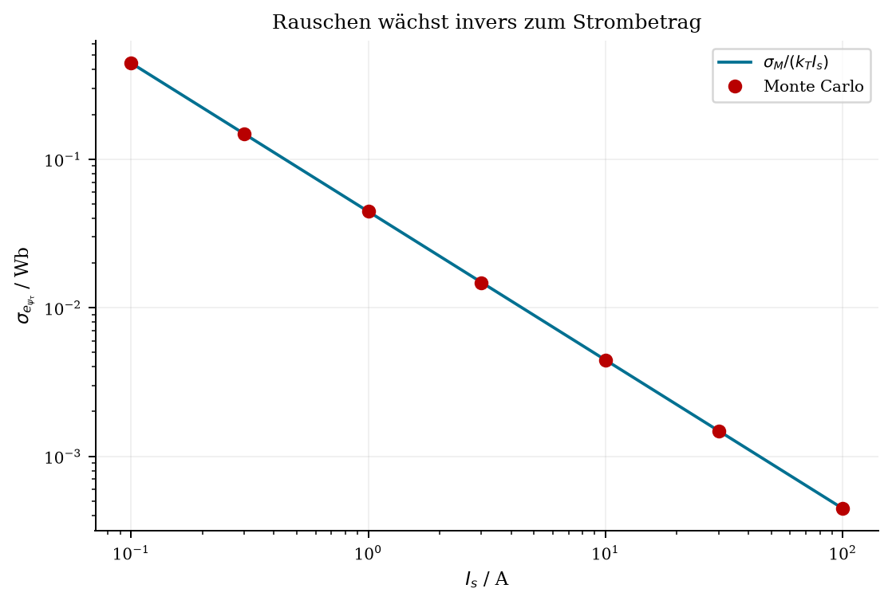

# Synthetische Validierung der Torque-Flussprojektion

Alle 40 Prüfungen bestanden, mit 1499 zufälligen
Strompunkten und Seed 20261007. Dies validiert die mathematischen Eigenschaften
der angenommenen Modelle; es ist keine Prüfstandsvalidierung.

## Reproduktion

```powershell
.\.venv\Scripts\python.exe docs/torque_flux_consistency/proof_of_concept.py
```

NumPy und Matplotlib sowie `kpsewhich` für die kanonische Palette sind
erforderlich. `--checks-only` lässt vorhandene Grafiken unverändert und führt
nur die numerischen Prüfungen aus. Der Lauf schreibt ausschließlich lokale
Research-Ergebnisse und Grafiken. Quelldateihashes, Basisgrößen, Softwareversionen,
Rangtoleranzen und vollständige Zahlen stehen in [results.json](results.json).

## Beobachtbarkeit

Die deklarierte dimensionslose Potentialbasis ist
`[1, x, y, s, (x²−y²)/2, xy, s²]`, mit `s=(x²+y²)/2`.
Torque hat Rang 4 von 7: Potentialkonstante und zwei radiale Potentialmoden
sind unsichtbar. Gemeinsame ideale Spannungsinformation hebt den Rang auf 6;
eine Potentialgauge auf 7. Der affine Flussoperator hat Rang 5 von 6 und
behält den gemeinsamen Induktivitätsanteil im Nullraum. Eine reine d-Achsen-
Messung hat Rang 2 in der Potentialbasis. Das sind Beispiele für diese
Basis und Anregung, keine allgemeingültigen Kennfeldränge.

Die Blöcke sind mit `k_T I_* psi_*` bzw. `omega_e psi_*` normiert und nehmen
illustrativ gleiche Einheitsvarianzen der normierten Residuen an. Die Grafik
ist daher eine strukturelle Illustration, kein kalibrierter Informationsvergleich.
`null` bei `full_condition` bedeutet unendliche Kondition durch Nullraum.

## Rauschen bei kleinen Strömen

Unabhängiges Gaußrauschen mit angenommener Momentstandardabweichung 0.2 Nm,
100 000 Ziehungen pro Strombetrag, sonst exakt bekannte Ströme.

| Strom in A | Erwartete Standardabweichung in Wb | Monte Carlo in Wb |
|---|---:|---:|
| 0.1 | 0.444444 | 0.443355 |
| 0.3 | 0.148148 | 0.147963 |
| 1 | 0.0444444 | 0.0444869 |
| 3 | 0.0148148 | 0.0147769 |
| 10 | 0.00444444 | 0.00445305 |
| 30 | 0.00148148 | 0.00148576 |
| 100 | 0.000444444 | 0.000444924 |



Die relative Abweichung vom analytischen Wert liegt an jedem Punkt unter
1.5 Prozent. Die Werte sind ausdrücklich illustrative Rauschannahmen.
Zusätzlich wurden 0.2 A Stromrauschen und 0.03 rad geschätzter Winkelvorsprung
bei unverändertem Kennfeld untersucht. Ihre Bias-/Streuungszahlen stehen in
JSON; beide enthalten auch den Effekt der Kennfeldauswertung an verschobenen
Argumenten. Eine kohärente Rotation von Strom und Fluss lässt Moment dagegen
bis Rundung unverändert.

## Detailprüfungen

Die Maximumfehler tragen die im Prüfnamen angegebenen Einheiten. Numerische
Toleranzen sind Rundungs-/Differentiationstoleranzen, keine Messunsicherheiten.
Der Stromgradient wird unabhängig durch zentrale Differenzen geprüft.

| Prüfung | Maximaler Absolutfehler | Ergebnis |
|---|---:|---|
| perfect_map_Nm | 0.0 | bestanden |
| power_invariant_scaling_Nm | 2.842170943040401e-14 | bestanden |
| basis_orthonormal | 0.0 | bestanden |
| clockwise_normal | 0.0 | bestanden |
| observable_projection_Wb | 3.9898639947466563e-17 | bestanden |
| observable_corrected_torque_Nm | 2.1316282072803006e-14 | bestanden |
| observable_remaining_parallel_Wb | 4.163336342344337e-17 | bestanden |
| observable_parallel_preserved_Wb | 1.3444106938820255e-17 | bestanden |
| parallel_projection_Wb | 4.367947781167707e-17 | bestanden |
| parallel_corrected_torque_Nm | 1.4210854715202004e-14 | bestanden |
| parallel_remaining_parallel_Wb | 3.903127820947816e-17 | bestanden |
| parallel_parallel_preserved_Wb | 1.2264177204165438e-17 | bestanden |
| mixed_projection_Wb | 4.2500725161431774e-17 | bestanden |
| mixed_corrected_torque_Nm | 2.1316282072803006e-14 | bestanden |
| mixed_remaining_parallel_Wb | 3.8163916471489756e-17 | bestanden |
| mixed_parallel_preserved_Wb | 1.3769367590565906e-17 | bestanden |
| weighted_constraint_AWb | 2.7755575615628914e-17 | bestanden |
| weighted_stationarity | 6.938893903907228e-18 | bestanden |
| zero_current_torque_Nm | 0.0 | bestanden |
| zero_and_threshold_mask | — | bestanden |
| offset_pattern_Wb | 8.998878031629687e-18 | bestanden |
| gain_pattern_Wb | 1.3444106938820255e-17 | bestanden |
| resistance_sign_-800_Nm | 2.4980018054066022e-14 | bestanden |
| resistance_equivalent_-800_ohm | 4.716279450311944e-15 | bestanden |
| resistance_sign_400_Nm | 2.3314683517128287e-14 | bestanden |
| resistance_equivalent_400_ohm | 1.399054483375295e-15 | bestanden |
| resistance_sign_1200_Nm | 2.503552920529728e-14 | bestanden |
| resistance_equivalent_1200_ohm | 5.13694989323632e-15 | bestanden |
| loss_pattern_1000_Wb | 9.324138683375338e-18 | bestanden |
| loss_pattern_3000_Wb | 1.3877787807814457e-17 | bestanden |
| PSM_linear_Nm | 3.197442310920451e-14 | bestanden |
| EESM_linear_Nm | 2.842170943040401e-14 | bestanden |
| coherent_rotation_Nm | 2.842170943040401e-14 | bestanden |
| composed_current_gradient_Nm_per_A | 1.8746698637883696e-11 | bestanden |
| noise_inverse_current | — | bestanden |
| joint_determinant | 1.4551915228366852e-11 | bestanden |
| joint_flux_R_recovery | 3.86843335142828e-16 | bestanden |
| global_radial_null_modes | 4.440892098500626e-16 | bestanden |
| global_joint_coefficients | 7.112366251504909e-16 | bestanden |
| global_rank_and_recovery | — | bestanden |

## Grenzen

Die lokalen harten Korrekturen zeigen Projektion und gewichtete Optimalität.
Sie werden nicht als reale Korrektur angewendet. Die globale Koeffizienten-
Rückgewinnung verwendet ideale, exakt repräsentierbare Daten; sie beweist
keine allgemeine Sättigungsrekonstruktion. Verlust-, Sensor-, Strom- und
Winkelfehler werden hier getrennt illustriert. Reale korrelierte Fehler,
Harmonische, thermische Zustände, EESM-Rotorportidentifikation und ein
praktischer globaler Fit mit unbekannten Nebenparametern bleiben offen.
